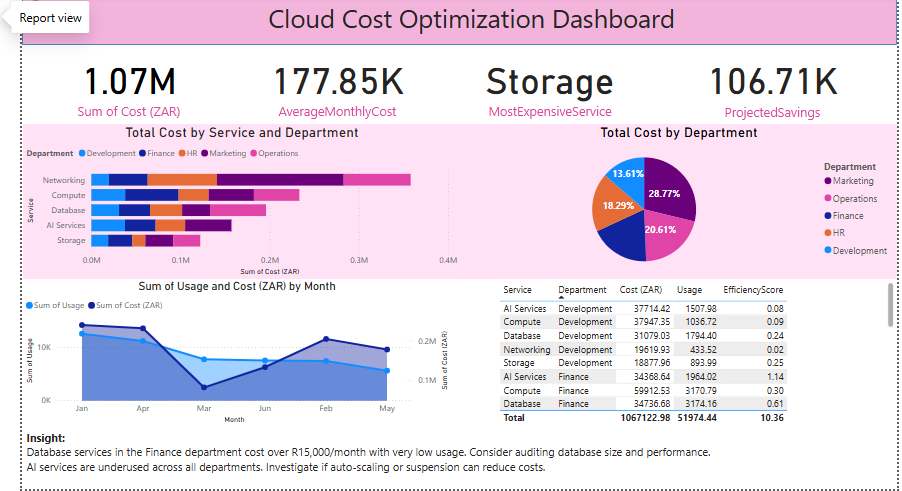

# 📊 Cloud Cost Optimization Dashboard

A Power BI dashboard that visualizes cloud cost and usage data to support cloud cost optimization efforts across various departments and services.

## 🚀 Features
- **Key Metrics**: Total cost, average monthly cost, most expensive service, and projected savings.
- **Visual Breakdown**:
  - Horizontal stacked bar chart: Cost by service and department
  - Pie chart: Cost distribution by department
  - Line & area chart: Cost vs. usage trends by month
  - Table with calculated efficiency score per service/department
- **Custom Metric**: `EfficiencyScore = Usage / Cost` to identify high-cost/low-usage services
- **Clean Layout** with intuitive, color-coded visuals

## 🛠️ Built With
- **Power BI Desktop**
- **Excel (for sample dataset)**
- **SQL (for query simulation)**

## 🧠 Business Insight
This dashboard enables:
- Identification of high-cost departments
- Cost-saving opportunities via the efficiency metric
- Monthly trends to track spending changes

## 📁 Files
- `Cloud-Cost-Optimization-Dashboard.pbix` – Power BI file
- `sample-data.xlsx` – Cloud service cost and usage data
- `dashboard-preview.png` – Screenshot of the final dashboard

## 📸 Preview

## 📬 Contact
Feel free to connect with me on [LinkedIn](www.linkedin.com/in/zama-lindi) or email me at zamaz.zl23@gmail.com

---

> 💡 This dashboard was built as a demonstration of Business Intelligence skills in preparation for Business Intelligence Analyst or Data Analyst roles.

